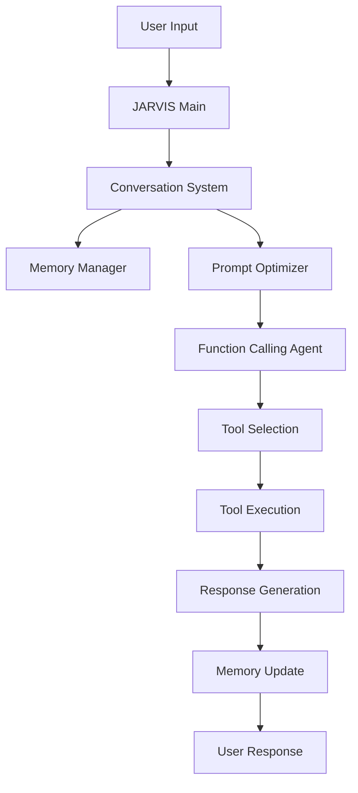

# 🤖 JARVIS - Advanced AI Assistant

> *"Just A Rather Very Intelligent System"*

JARVIS is a sophisticated AI assistant with modular architecture, advanced conversation management, and powerful tool integration capabilities. Built with Python, it features semantic memory, RAG (Retrieval Augmented Generation), and a comprehensive agentic system.

## ✨ Features

### 🧠 **Advanced Conversation System**
- **Modular Architecture**: Clean, extensible design with separate components
- **Semantic Memory**: AI remembers important context across conversations
- **Multiple Embedding Backends**: Choose from local or cloud-based embeddings
- **Context-Aware Responses**: Intelligent conversation history management

### 🛠️ **Powerful Tool Integration**
- **Function Calling Agent**: Automatically selects and executes appropriate tools
- **Web Search**: Real-time information retrieval from the internet
- **Website Analysis**: Extract and analyze content from any URL
- **PDF Processing**: Read and analyze PDF documents
- **News Retrieval**: Get latest news on any topic
- **Network Diagnostics**: Check internet speed and connectivity

### 🎯 **RAG System (Retrieval Augmented Generation)**
- **Intelligent Retrieval**: Find relevant information from conversation history
- **Embedding-Based Search**: Semantic similarity matching
- **Context Integration**: Automatically include relevant background information
- **Memory Importance Scoring**: Prioritize significant interactions

### 🔧 **Agentic Architecture**
- **Multi-Agent Coordination**: Specialized agents for different tasks
- **Task Planning**: Break down complex requests into actionable steps
- **Error Recovery**: Graceful handling of failures with retry mechanisms
- **Tool Orchestration**: Intelligent sequencing of multiple tools

## 🚀 Quick Start

### Installation

1. **Clone the repository**
   ```bash
   git clone https://github.com/OEvortex/JARVIS.git
   cd JARVIS
   ```

2. **Install dependencies**
   ```bash
   pip install -r requirements.txt
   ```

3. **Run JARVIS**
   ```bash
   python main.py
   ```

### Basic Usage

```python
from conversation import JARVISConversation
from conversation.config import ConversationConfig

# Initialize JARVIS conversation
config = ConversationConfig()
jarvis = JARVISConversation(name="YourName", config=config)

# Start chatting
jarvis.add_message("User", "Hello JARVIS, search for Python tutorials")
response = jarvis.generate_complete_prompt("Find the latest AI news")
```

## 🏗️ Architecture

### Core Components

```
JARVIS/
├── main.py                 # Main application entry point
├── conversation/           # Enhanced conversation system
│   ├── core.py            # Main conversation management
│   ├── memory.py          # Semantic memory system  
│   ├── embeddings.py      # Multiple embedding backends
│   ├── prompt_optimizer.py # Intelligent prompt generation
│   └── config.py          # Configuration management
├── AGENTS/                # Multi-agent system
│   ├── functioncall.py    # Function calling agent
│   ├── taskforge.py       # Task planning and execution
│   └── proxy.py           # Proxy management for API calls
├── TOOL/                  # Tool implementations
│   └── main.py            # Web search, PDF processing, etc.
└── config/                # System configuration
    └── config.py          # Global settings
```

### Data Flow



## 🔧 Configuration

### Embedding Backends

Choose from multiple embedding options:

```python
from conversation.config import EmbeddingConfig, EmbeddingBackend

# No embeddings (keyword search)
config.embedding = EmbeddingConfig(backend=EmbeddingBackend.NONE)

# Local embeddings with Sentence Transformers
config.embedding = EmbeddingConfig(
    backend=EmbeddingBackend.SENTENCE_TRANSFORMERS,
    model_name="all-MiniLM-L6-v2"
)

# OpenAI embeddings (requires API key)
config.embedding = EmbeddingConfig(
    backend=EmbeddingBackend.OPENAI,
    api_key="your-openai-api-key"
)
```

### Advanced Configuration

```python
config = ConversationConfig(
    max_tokens=8000,                    # Maximum token limit
    history_offset=10250,               # History buffer size
    save_interval=300,                  # Auto-save interval (seconds)
    max_memory_entries=100,             # Memory limit
    history_folder="History",           # Data storage folder
)
```

## 🛠️ Available Tools

### Web Tools
- **`websearch(query)`**: Search the internet for information
- **`ask_website(url, question)`**: Analyze and ask questions about websites
- **`get_news(topic, max_results)`**: Get latest news on any topic
- **`check_internet_speed()`**: Test internet connection speed

### Document Processing
- **`process_pdf(path, mode, output_path)`**: Extract and analyze PDF content

### System Tools
- **`general_ai(question)`**: General AI reasoning and responses

## 📖 Usage Examples

### Basic Conversation
```python
jarvis = JARVIS()

# Ask a question
jarvis.execute_tool_and_respond("What's the latest news about AI?")

# Search for information  
jarvis.execute_tool_and_respond("Search for Python machine learning tutorials")

# Analyze a website
jarvis.execute_tool_and_respond("What is the main topic of https://python.org?")
```

### Advanced Memory Usage
```python
# Search conversation history
memories = conversation.memory_manager.search_memories("programming")

# Get contextual information
context = conversation.memory_manager.get_memory_context("AI projects")

# Export conversation data
json_data = conversation.export_conversation("json")
text_data = conversation.export_conversation("txt")
```

### Tool Integration
```python
# Process complex multi-step requests
jarvis.execute_tool_and_respond(
    "Search for the latest Python releases, then check the Python website for documentation"
)

# Analyze documents and provide insights
jarvis.execute_tool_and_respond(
    "Process this PDF and summarize the key findings: /path/to/document.pdf"
)
```

## 🧪 RAG System Features

### Intelligent Retrieval
- **Semantic Search**: Find contextually similar conversations
- **Keyword Matching**: Fallback to traditional text search
- **Importance Filtering**: Surface the most relevant memories
- **Temporal Awareness**: Consider recency and frequency

### Context Integration
```python
# Automatic context retrieval
enhanced_prompt = conversation.generate_complete_prompt(
    "Continue our discussion about machine learning"
)

# Manual memory search
relevant_context = memory_manager.search_memories(
    "machine learning", 
    min_importance=0.6
)
```

## 🎯 Agentic System

### Multi-Agent Architecture
- **Function Calling Agent**: Tool selection and execution
- **Task Planning Agent**: Break down complex requests
- **Memory Agent**: Context retrieval and storage
- **Response Agent**: Generate coherent responses

### Agent Coordination
```python
# Agents work together automatically
user_request = "Research AI trends and create a summary report"

# 1. Task Planning Agent breaks down the request
# 2. Function Calling Agent executes web searches
# 3. Memory Agent stores important findings
# 4. Response Agent synthesizes final summary
```

## 📁 File Storage

JARVIS creates organized data storage:

```
History/
├── JARVISConversation_history.txt    # Complete conversation log
├── chat.txt                          # Real-time chat buffer  
├── memory.txt                        # Legacy memory file
└── embeddings.json                   # Embedding database
```

## 🔍 Testing

Run the comprehensive test suite:

```bash
# Core functionality tests
python test_conversation.py

# Integration tests
python test_integration.py

# Embedding system demo
python demo_embeddings.py
```

## 🚀 Advanced Features

### Dataset Building
JARVIS automatically builds training datasets from interactions:

```python
# Automatic dataset creation
dataset_builder = DatasetBuilder(filepath="tool_usage.json")
dataset_builder.add_datapoint(
    user_input="Search for AI news",
    tool_calls=[...],
    response="Here are the latest AI developments..."
)
```

### Proxy Management
Built-in proxy support for API calls:

```python
proxy_manager = ProxyManager()
# Automatically handles proxy rotation and error recovery
```

### Rich Console Output
Beautiful console interface with color-coded responses:

```python
from rich import print as rprint
rprint("[bold green]JARVIS:[/] How can I help you today?")
```

## 🤝 Contributing

1. **Fork the repository**
2. **Create a feature branch**: `git checkout -b feature/amazing-feature`
3. **Commit changes**: `git commit -m 'Add amazing feature'`
4. **Push to branch**: `git push origin feature/amazing-feature`
5. **Open a Pull Request**

### Development Guidelines
- Follow existing code patterns and architecture
- Add tests for new features
- Update documentation
- Ensure backward compatibility

## 📋 Requirements

### Core Dependencies
```
webscout              # Web search and API access
sentence-transformers # Local embeddings (optional)
openai               # OpenAI embeddings (optional)
rich                 # Console formatting
typing-extensions    # Type hints support
```

### Optional Dependencies
- **Sentence Transformers**: For local embedding generation
- **OpenAI**: For cloud-based embeddings
- **Additional models**: Depending on your use case

## 🛡️ Error Handling

JARVIS includes comprehensive error handling:

- **Graceful Degradation**: Falls back to simpler methods when advanced features fail
- **Retry Mechanisms**: Automatically retries failed operations
- **Error Logging**: Detailed logging for debugging
- **User-Friendly Messages**: Clear error communication

## 📊 Performance

### Optimization Features
- **Intelligent Caching**: Avoid redundant API calls and computations
- **Memory Management**: Automatic cleanup of old data
- **Token Optimization**: Smart prompt trimming to stay within limits
- **Async Operations**: Non-blocking operations where possible

### Benchmarks
- **Startup Time**: < 3 seconds (without embedding model downloads)
- **Response Time**: 1-5 seconds (depending on tool complexity)
- **Memory Usage**: ~100-500MB (depending on conversation history)
- **Storage**: ~1-10MB per 1000 conversations

## 🔮 Future Roadmap

- [ ] **Multi-modal Support**: Image and voice processing
- [ ] **Plugin System**: Easy third-party tool integration
- [ ] **Web Interface**: Browser-based chat interface
- [ ] **Mobile App**: Cross-platform mobile application
- [ ] **Cloud Deployment**: Scalable cloud infrastructure
- [ ] **Advanced Analytics**: Conversation insights and metrics

## 📄 License

This project is licensed under the MIT License - see the [LICENSE](LICENSE) file for details.

## 🙏 Acknowledgments

- **OpenAI**: For providing excellent embedding APIs
- **Hugging Face**: For the Sentence Transformers library
- **Webscout**: For web search capabilities
- **Rich**: For beautiful console output
- **Python Community**: For the amazing ecosystem

## 📞 Support

- **Issues**: [GitHub Issues](https://github.com/OEvortex/JARVIS/issues)
- **Discussions**: [GitHub Discussions](https://github.com/OEvortex/JARVIS/discussions)
- **Documentation**: [Wiki](https://github.com/OEvortex/JARVIS/wiki)

---

**Built with ❤️ by the JARVIS Team**

*Making AI assistance more intelligent, one conversation at a time.*