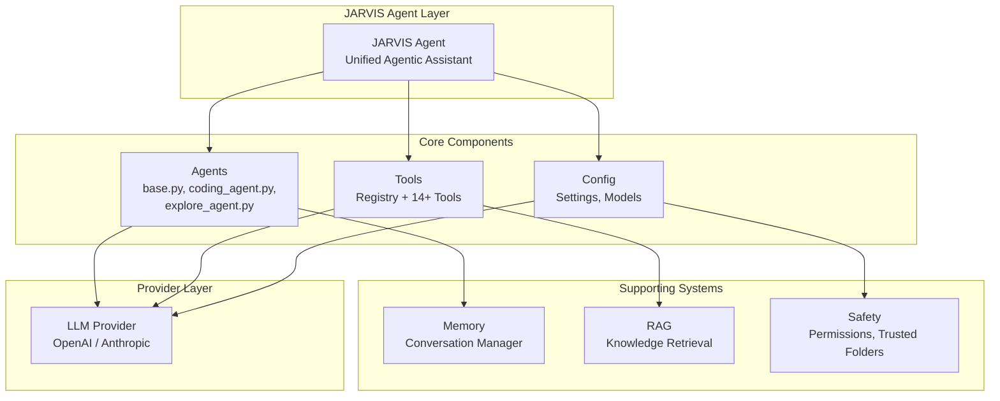
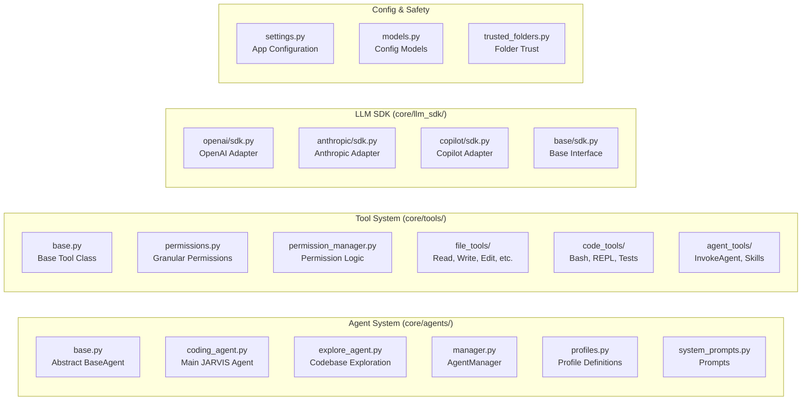

<div align="center">

# JARVIS v2.0.beta-coding

<a href="https://github.com/OEvortex/JARVIS"></a>
<a href="https://github.com/OEvortex/JARVIS/blob/main/LICENSE"></a>
<a href="https://github.com/OEvortex/JARVIS/stargazers"></a>
<a href="https://github.com/OEvortex/JARVIS/issues"></a>

**Your Personal AI Assistant - Fully Agentic PI with Claude Code-style Capabilities**

</div>

---

## 🚀 Overview

JARVIS v2.0 is a **Personal AI Assistant (PI)** - a next-generation agentic harness inspired by Claude Code and OpenClaude. It provides unified agentic assistance for coding, research, documentation, and knowledge work through intelligent tool usage.

### Key Features

| Feature | Description |
|---------|-------------|
| **🤖 Fully Agentic** | JARVIS agent handles coding, research, documentation, and complex tasks autonomously |
| **🔍 Explore Subagent** | Specialized agent for codebase exploration and architecture analysis |
| **🔧 14+ Tools** | Comprehensive tools for file ops, code execution, web fetching, and more |
| **🔒 Safety First** | Granular permission system with 5 agent profiles (SAFE to YOLO) |
| **💻 Dual Interfaces** | Rich CLI and modern TUI (Textual-based) with streaming support |
| **🔌 Multi-LLM** | OpenAI and Anthropic SDKs with easy configuration |

---

## 🎯 Current Status

This is **JARVIS v2.0.beta-coding** - the core Coding harness of JARVIS 2.0

| Component | Status |
|-----------|--------|
| ✅ LLM Provider Abstraction | Complete |
| ✅ Tool System | Complete (14 tools) |
| ✅ JARVIS Agent (PI) | Complete |
| ✅ Explore Subagent | Ready |
| ✅ CLI Interface | Complete |
| ✅ TUI Interface | Complete |
| ✅ Permission System | Complete |
| 🔄 More Specialized Agents | Coming Soon |

---

## 🏗️ Architecture

### System Overview





### Key Modules

| Module | Purpose |
|--------|---------|
| `core/agents/` | Agent implementations (BaseAgent, CodingAgent, ExploreAgent) |
| `core/tools/` | Tool system with 14+ tools and granular permissions |
| `core/llm_sdk/` | Multi-provider LLM adapters (OpenAI, Anthropic, Copilot) |
| `core/config/` | Application settings and configuration models |
| `core/memory/` | Conversation history and memory management |
| `core/rag/` | Knowledge retrieval system |
| `core/safety/` | Security, permissions, and trusted folder management |

### Core Components

| Component | Description |
|-----------|-------------|
| **BaseAgent** | Abstract base class providing memory, context management, streaming, and tool integration |
| **CodingAgent** | Main JARVIS agent for coding, research, documentation, and general assistance |
| **ExploreAgent** | Specialized subagent for comprehensive codebase exploration and analysis |
| **ToolRegistry** | Central registry managing all available tools with dynamic descriptions |
| **AgentManager** | Manages agent profiles and applies permission overrides |
| **Permission System** | Vibe-style granular permissions with path-based allowlist/denylist |

---

## 📦 Installation

### Prerequisites

- **Python 3.10+** (recommended 3.11+)
- **pip** package manager
- **API Key** from OpenAI or Anthropic

### Quick Setup

```bash
# Clone the repository
git clone https://github.com/OEvortex/JARVIS.git
cd JARVIS

# Install dependencies (using uv recommended)
uv pip install -e .

# Or using pip
pip install -e .
```

### Configuration

Create a `.env` file with your API keys:

```bash
cp .env.example .env
```

```env
JARVIS_MODEL=gpt-4o
JARVIS_BASE_URL=https://api.openai.com/v1
JARVIS_API_KEY=your_api_key_here
JARVIS_SDK=openai
```

---

## 🚀 Usage

### CLI Mode

```bash
# Using CLI flags
jarvis --cli --model gpt-4o --apikey YOUR_KEY --sdk openai

# Using .env configuration
jarvis --cli

# Using short flags
jarvis --cli -m gpt-4o --apikey YOUR_KEY
```

### TUI Mode

```bash
# Launch TUI interface
jarvis --tui --model gpt-4o --apikey YOUR_KEY

# With custom base URL (for local LLMs)
jarvis --tui --model llama-3-70b --base_url http://localhost:8000/v1 --apikey dummy --sdk openai
```

### Available CLI Flags

| Flag | Short | Description |
|------|-------|-------------|
| `--model` | `-m` | Model name (e.g., `gpt-4o`, `claude-3-5-sonnet-20241022`) |
| `--base_url` | | Base URL for LLM API |
| `--apikey` | `--api-key` | API key for the provider |
| `--sdk` | | SDK mode: `openai`, `anthropic`, or `standard` |
| `--cli` | | Launch CLI interface |
| `--tui` | `--TUI` | Launch TUI interface |
| `--bypass` | `--yolo` | Bypass all tool permissions |

---

## 🛠️ Available Tools

JARVIS comes with 14+ built-in tools for comprehensive task handling:

### File Operations

| Tool | Description |
|------|-------------|
| `read` | Read file(s) with parallel support and offset/limit |
| `write` | Create new files (fails if exists) |
| `edit` | Edit existing files with string replacements |
| `list_dir` | List directory contents |
| `glob` | Search files by glob pattern |

### Code Execution

| Tool | Description |
|------|-------------|
| `bash` | Execute shell commands |
| `repl` | Interactive Python REPL |
| `run_tests` | Run test files with pytest |

### Search & Discovery

| Tool | Description |
|------|-------------|
| `grep` | Search for patterns in files |

### Web & Background

| Tool | Description |
|------|-------------|
| `web_fetch` | Fetch web content |
| `list_background_processes` | List running background processes |
| `read_background_output` | Read background process output |

### Memory & Agents

| Tool | Description |
|------|-------------|
| `save_memory` | Save information to memory |
| `read_memory` | Read from memory |
| `invoke_agent` | Invoke the Explore subagent for codebase analysis |
| `activate_skill` | Activate specialized skills |

---

## 👤 Agent Profiles

**JARVIS** is your main **Personal AI Assistant (PI)** agent. The Explore subagent handles specialized codebase analysis. Switch between safety levels for your workflow:

| Profile | Safety Level | Description |
|---------|--------------|-------------|
| `default` | NEUTRAL | Read ops allowed, writes and commands need approval |
| `plan` | SAFE | Read-only for exploration and planning |
| `accept-edits` | DESTRUCTIVE | Auto-approves file edits |
| `auto-approve` | YOLO | Auto-approves all (use with caution) |
| `explore` | SAFE (Subagent) | Read-only subagent for codebase exploration |

**Cycle profiles with `Shift+Tab` in TUI.**

### Permission System

**Permission Levels:**
- **ALWAYS**: Tool executes without asking
- **NEVER**: Tool is permanently disabled
- **ASK**: Tool requires user approval (default)

**Granular Permissions (Vibe-style):**
- **Path-based allowlist/denylist**: Files matching patterns are always/never allowed
- **Sensitive file patterns**: Files matching sensitive patterns require special approval
- **Workdir boundary**: Files outside working directory require approval
- **Scratchpad paths**: Files in scratchpad directories are always allowed
- **Dangerous command patterns**: Bash commands with dangerous patterns require special approval

---

## 🔧 Configuration Reference

### Environment Variables

```env
# LLM Configuration
JARVIS_MODEL=gpt-4o
JARVIS_BASE_URL=https://api.openai.com/v1
JARVIS_API_KEY=your_api_key
JARVIS_SDK=openai

# Token Limits (optional)
JARVIS_MAX_CONTEXT_TOKENS=131072
JARVIS_MAX_INPUT_TOKENS=111616
JARVIS_MAX_OUTPUT_TOKENS=16384
```

### Agent Model Selection

```python
# Initialize with specific model
jarvis = CodingAgent(provider, tool_registry, model="gpt-4o")
```

---

## 💻 Development

### Running Tests

```bash
# Run all tests
pytest tests/

# Run with coverage
pytest tests/ --cov=core
```

### Code Quality

```bash
# Format code
black core/ interface/ jarvis/

# Lint
ruff check core/ interface/ jarvis/
```

### Project Structure

```
JARVIS/
├── core/
│   ├── agents/          # Agent system (CodingAgent, ExploreAgent)
│   ├── config/          # Configuration and settings
│   ├── llm_sdk/         # LLM provider SDKs
│   ├── tools/           # Tool implementations
│   ├── memory/          # Semantic memory system
│   ├── rag/             # RAG system
│   ├── safety/          # Safety manager
│   └── skills/          # Skill management
├── interface/
│   ├── cli/             # Rich CLI interface
│   └── textual_ui/      # TUI interface
├── jarvis/              # Entry point
├── tests/               # Test suite
└── docs/                # Documentation
```

---

## 🤝 Contributing

Contributions are welcome! Please read our contributing guidelines before submitting PRs.

1. Fork the repository
2. Create a feature branch (`git checkout -b feature/amazing-feature`)
3. Commit your changes (`git commit -m 'Add amazing feature'`)
4. Push to the branch (`git push origin feature/amazing-feature`)
5. Open a Pull Request

---

## 📄 License

MIT License - see [LICENSE](LICENSE) for details.

---

## 🔗 Links

- **Repository**: https://github.com/OEvortex/JARVIS
- **Issues**: https://github.com/OEvortex/JARVIS/issues
- **Author**: [OEvortex](https://github.com/OEvortex)

---

<div align="center">
<sub>Built with ❤️ for developers who want a truly agentic AI assistant</sub>
</div>