<div align="center">

# JARVIS v2.0


<a href="https://github.com/OEvortex/JARVIS"></a>
<a href="https://github.com/OEvortex/JARVIS/blob/main/LICENSE"></a>
<a href="https://github.com/OEvortex/JARVIS/stargazers"></a>
<a href="https://github.com/OEvortex/JARVIS/issues"></a>

**Your Personal AI Assistant - Fully Agentic AI Harness with Claude Code-style Capabilities**

</div>

<div align="center">

[📖 Docs](docs/SUMMARY.md) • [🚀 Setup](docs/SETUP.md) • [🏗️ Architecture](docs/ARCHITECTURE.md) • [📡 API](docs/API.md) • [💻 Contributing](docs/CONTRIBUTING.md)

</div>

---

## 🚀 Overview

JARVIS v2.0 is a **Personal AI Assistant (PI)** - a next-generation agentic harness inspired by Claude Code and mistral-vibe. It provides unified agentic assistance for coding, research, documentation, and knowledge work through intelligent tool usage.

### Key Features

| Feature | Description |
|---------|-------------|
| **🤖 Fully Agentic** | JARVIS agent handles coding, research, documentation, and complex tasks autonomously |
| **🔍 Explore Subagent** | Specialized agent for codebase exploration and architecture analysis |
| **📝 Plan Subagent** | Specialized agent for planning and task decomposition |
| **🍴 Fork Subagent** | Fork conversation context for parallel exploration |
| **🔌 MCP Integration** | Connect to external MCP servers (stdio/HTTP transports) |
| **🌐 WebUI** | Full-featured browser-based interface with FastAPI backend |
| **🎨 Techy WebUI** | Modern dark UI with infinite canvas, dot grid, slash commands, thinking picker |
| **💡 Learning System** | Pattern detection, skill creation, and self-evaluation |
| **💾 Semantic Memory** | Memory management for knowledge retrieval |
| **💻 Dual Interfaces** | Rich CLI, modern TUI (Textual), and WebUI |
| **🔒 Safety First** | Granular permission system with 5 agent profiles |
| **🔧 20+ Tools** | Comprehensive tools for file ops, code execution, web, and more |
| **🔌 Multi-LLM** | OpenAI, Anthropic, and custom SDK adapters |
| **☁️ Remote Sessions** | Connect to remote JARVIS instances via JARVIS_REMOTE_URL |

---

## 🎯 Current Status

| Component | Status |
|-----------|--------|
| ✅ LLM Provider Abstraction | Complete |
| ✅ Tool System | Complete (20+ tools) |
| ✅ JARVIS Agent (PI) | Complete |
| ✅ Explore Subagent | Ready |
| ✅ Plan Subagent | Ready |
| ✅ Fork Subagent | Ready |
| ✅ CLI Interface | Stable |
| ✅ TUI Interface | Complete (Default) |
| ✅ WebUI | Complete (with slash commands, thinking picker, remote sessions) |
| ✅ Permission System | Complete |
| ✅ MCP Integration | Complete |
| ✅ Learning System | Complete |
| ✅ Heartbeat System | Complete |
| ✅ Connectors System | Complete |
| ✅ Session Management | Complete (local + remote) |

---

## 🏗️ Architecture

### System Overview

```mermaid
graph TB
    %% Nodes definition
    subgraph "JARVIS Agent Layer"
        Jarvis["JarvisV2 (Main Agent)<br/>core/agents/jarvis_v2.py"]
    end

    subgraph "Core Managers & Controllers"
        AgentMgr["AgentManager<br/>core/agents/manager.py"]
        ToolReg["ToolRegistry<br/>core/tools/registry.py"]
        Config["Settings & Models<br/>core/config/settings.py"]
        History["ConversationHistory<br/>core/history.py"]
    end

    subgraph "Specialized Agents"
        ExploreAg["ExploreAgent<br/>explore_agent.py"]
        PlanAg["PlanAgent<br/>plan_agent.py"]
        ForkAg["ForkSubagent<br/>fork_subagent.py"]
        BuiltinAg["BuiltinAgents<br/>builtin_agents.py"]
    end

    subgraph "Toolbox (20+ Tools)"
        FileTools["File Tools<br/>file_tools.py / file_edit_tool.py"]
        GrepTool["Grep Tool<br/>grep_tool.py"]
        ReplTool["REPL Tool<br/>repl_tool.py"]
        MCPTool["MCP Adapter<br/>mcp_adapter.py"]
        WebTools["Web Tools<br/>web_tools.py"]
        SkillTool["Skill Tools<br/>skill_tool.py"]
    end

    subgraph "Supporting Systems"
        Skills["SkillManager<br/>core/skills/manager.py"]
        Safety["PermissionManager<br/>core/tools/permissions.py"]
        Learn["LearningManager<br/>core/learn/learning_manager.py"]
        Connectors["ConnectorManager<br/>core/connectors/manager.py"]
    end

    subgraph "LLM Provider Layer"
        SDK["LLM SDK Adapter<br/>core/llm/sdk_adapter.py"]
        OpenAI["OpenAI SDK<br/>core/llm_sdk/openai"]
        Anthropic["Anthropic SDK<br/>core/llm_sdk/anthropic"]
        Gemini["Gemini SDK<br/>core/llm_sdk/geminicli"]
    end

    %% Relationships & Flow
    Jarvis --> AgentMgr
    Jarvis --> ToolReg
    Jarvis --> Config
    Jarvis --> History

    AgentMgr --> ExploreAg
    AgentMgr --> PlanAg
    AgentMgr --> ForkAg
    AgentMgr --> BuiltinAg

    ToolReg --> FileTools
    ToolReg --> GrepTool
    ToolReg --> ReplTool
    ToolReg --> MCPTool
    ToolReg --> WebTools
    ToolReg --> SkillTool

    Jarvis --> Learn
    Jarvis --> Connectors
    
    %% Interactions (Working)
    FileTools --> Safety
    GrepTool --> Safety
    ReplTool --> Safety
    
    SkillTool --> Skills
    Learn --> Skills
    
    Jarvis --> SDK
    ExploreAg --> SDK
    PlanAg --> SDK
    
    SDK --> OpenAI
    SDK --> Anthropic
    SDK --> Gemini

    %% Styling
    classDef main fill:#ffcccc,stroke:#333,stroke-width:2px;
    classDef core fill:#ccffcc,stroke:#333,stroke-width:1px;
    classDef agent fill:#ccccff,stroke:#333,stroke-width:1px;
    classDef tool fill:#ffffcc,stroke:#333,stroke-width:1px;
    classDef support fill:#ffccff,stroke:#333,stroke-width:1px;
    classDef sdk fill:#ccffff,stroke:#333,stroke-width:1px;

    class Jarvis main;
    class AgentMgr,ToolReg,Config,History core;
    class ExploreAg,PlanAg,ForkAg,BuiltinAg agent;
    class FileTools,GrepTool,ReplTool,MCPTool,WebTools,SkillTool tool;
    class Skills,Safety,Learn,Connectors support;
    class SDK,OpenAI,Anthropic,Gemini sdk;
```




### Directory Structure

```
JARVIS/
├── core/                   # Python backend
│   ├── agents/                # Agent system (base.py, jarvis_v2.py, manager.py, profiles, prompts/)
│   ├── tools/                 # Tool system (registry, base, permissions, 20+ tools, MCP, sandbox)
│   ├── llm/                   # LLM provider abstraction (SDKAdapter, model info)
│   ├── llm_sdk/               # Provider SDKs (openai/, anthropic/)
│   ├── provider/              # Provider manager & models
│   ├── config/                # Settings (JSON + env overrides)
│   ├── connectors/            # External data connectors (github, http, rss, weather, filesystem)
│   ├── learn/                 # Learning system (pattern detection, skill crystallization)
│   ├── skills/                # Skill management (CRUD, sources, trace collection)
│   ├── rewind/                # Conversation checkpointing with file snapshots
│   ├── watchers/              # Passive file/event watchers
│   ├── web/                   # FastAPI web server (REST + WebSocket endpoints)
│   └── agents/                # Agent lifecycle, prompts, builtins
├── interface/             # User interfaces
│   ├── cli/                   # prompt_toolkit-based CLI
│   ├── textual_ui/            # Textual-based TUI (30+ widgets)
│   └── webui/                 # React/TypeScript WebUI (Vite + Tailwind + shadcn)
├── jarvis/                # Entry point & launcher
├── tests/                 # Python test suite (pytest)
├── docs/                  # 📖 Documentation
│   ├── SUMMARY.md            # Entry point with quick-links
│   ├── SETUP.md              # Installation & configuration
│   ├── ARCHITECTURE.md       # Full system architecture
│   ├── API.md                # REST + WebSocket API reference
│   ├── CONTRIBUTING.md       # Development guide
│   ├── custom-agents.md      # Custom agent profiles
│   ├── custom-tools.md       # Writing new tools
│   ├── MCP.md                # MCP server integration
│   ├── SANDBOX.md            # Sandboxed execution
│   ├── watchers.md           # File/event watchers
│   └── webui-theme.md        # CSS variable theming
├── main.py               # Application entry point
├── providers.json         # LLM provider definitions
├── pyproject.toml          # Python project config
└── .env.example           # Environment variables template
```

---

## 📦 Installation

### Prerequisites

- **Python 3.10+** (recommended 3.11+)
- **API Key** from OpenAI or Anthropic

### Quick Setup

```bash
# Clone the repository
git clone https://github.com/OEvortex/JARVIS.git
cd JARVIS

# Create virtual environment
uv venv

# Activate virtual environment
# On Linux/macOS:
source .venv/bin/activate
# On Windows:
.venv\Scripts\activate

# Install dependencies
uv pip install -e .
```

### Configuration

Create a `.env` file with your API keys:

```bash
cp .env.example .env
```

```env
JARVIS_MODEL=gpt-4o
JARVIS_BASE_URL=https://api.openai.com/v1
JARVIS_API_KEY=your_api_key_here
JARVIS_SDK=openai
```

For more advanced configuration, create a `.jarvis/settings.json` file (see Configuration Reference below).

---

## 🚀 Usage

### TUI Mode (Default)

```bash
# Launch TUI interface (default - uses .env file from current working directory)
jarvis

# With explicit configuration
jarvis --model gpt-4o --apikey YOUR_KEY

# With custom base URL (for local LLMs)
jarvis --model llama-3-70b --base_url http://localhost:8000/v1 --apikey dummy --sdk openai
```

### CLI Mode

```bash
# Using CLI flags
jarvis --cli --model gpt-4o --apikey YOUR_KEY --sdk openai

# Using .env configuration
jarvis --cli

# Using short flags
jarvis --cli -m gpt-4o --apikey YOUR_KEY
```

### WebUI Mode

```bash
# Launch WebUI interface (default: http://127.0.0.1:5173)
jarvis --webui

# With custom port
jarvis --webui --port 8080 --backend-port 8765

# Expose to network
jarvis --webui --host 0.0.0.0 --port 5173
```

#### WebUI Features

- **Model Picker**: Browse & switch LLM models grouped by provider with capability badges
- **MCP Servers**: Add/remove/connect MCP servers with status monitoring
- **Heartbeat Monitor**: Start/stop heartbeat scheduler, view task files and results
- **Rewind**: Browse session checkpoints and rewind conversation state
- **Config/Settings**: Thinking level selector, working preference toggles
- **Voice Input**: Browser-based voice recording via MediaRecorder API
- **Context Progress**: Real-time token usage display with progress bars
- **Connector Auth**: Authenticate external services (GitHub, Weather, etc.)
- **Safety Profiles**: 5 safety levels (Lockdown→Unrestricted), cycle with Shift+Tab
- **Debug Console**: Terminal-style debug command interface
- **Feedback Widget**: 3-emoji rating system persisted to disk
- **Question Dialog**: Structured question forms from WebSocket `user_input` events
- **Approval Dialog**: Amber-themed tool approval overlay with always-allow
- **Slash Commands**: Type `/` for autocomplete (help, status, model, mcp, heartbeat, rewind, config, debug, feedback, etc.)
- **Thinking Picker**: Select AI reasoning level (Low/Medium/High) for each message
- **Infinite Canvas**: Draggable dot grid background that extends infinitely
- **Right Sidebar**: Fixed tool strip with icons for all feature panels
- **Remote Sessions**: Connect to remote JARVIS instances via `JARVIS_REMOTE_URL` env variable
- **Markdown Rendering**: Beautiful tables, lists, headings with blue theme styling
- **Session Management**: Resume/load previous sessions from local storage
- **Auto-Greeting**: Sends "hi" on connect so users see immediate activity

#### Environment Variables for WebUI

```env
# Remote sessions (optional)
JARVIS_REMOTE_URL=https://your-remote-jarvis.com
```

### Available CLI Flags

| Flag | Short | Description |
|------|-------|-------------|
| `--model` | `-m` | Model name (e.g., `gpt-4o`, `claude-3-5-sonnet-20241022`) |
| `--base_url` | | Base URL for LLM API |
| `--apikey` | `--api-key` | API key for the provider |
| `--sdk` | | SDK mode: `openai` or `anthropic` |
| `--cli` | | Launch CLI interface |
| `--tui` | `--TUI` | Launch TUI interface (default) |
| `--webui` | | Launch WebUI interface |
| `--bypass` | `--yolo` | Bypass all tool permissions |
| `--host` | `-H` | WebUI host (default: 127.0.0.1) |
| `--port` | `-p` | WebUI frontend port (default: 5173) |
| `--backend-port` | `-b` | WebUI backend port (default: 8765) |

---

## 🛠️ Available Tools

JARVIS comes with 20+ built-in tools for comprehensive task handling:

### File Operations

| Tool | Description |
|------|-------------|
| `read` | Read file(s) with parallel support and offset/limit |
| `write` | Create new files (fails if exists) |
| `edit` | Edit existing files with string replacements |
| `list_dir` | List directory contents |
| `glob` | Search files by glob pattern |

### Code Execution

| Tool | Description |
|------|-------------|
| `bash` | Execute shell commands |
| `repl` | Interactive Python REPL |
| `run_tests` | Run test files with pytest |

### Search & Discovery

| Tool | Description |
|------|-------------|
| `grep` | Search for patterns in files |

### Web & Network

| Tool | Description |
|------|-------------|
| `web_fetch` | Fetch web content |
| `web_search` | Search the web via Brave API |

### Background & Async

| Tool | Description |
|------|-------------|
| `run_in_background` | Run commands in background |
| `list_background_processes` | List running background processes |
| `read_background_output` | Read background process output |

### Memory & Knowledge

| Tool | Description |
|------|-------------|
| `save_memory` | Save information to semantic memory |
| `read_memory` | Read from memory |
| `learn_from_interaction` | Learn from interactions |

### Agents & Skills

| Tool | Description |
|------|-------------|
| `agents` | Invoke subagents (explore, plan, fork) |
| `activate_skill` | Activate specialized skills |
| `manage_skills` | Create and manage custom skills |
| `ask_user_question` | Ask user structured questions |

### MCP Tools

| Tool | Description |
|------|-------------|
| `mcp_tools` | Execute tools from connected MCP servers |
| `mcp_list_servers` | List connected MCP servers |

### System Tools

| Tool | Description |
|------|-------------|
| `clipboard_read` | Read system clipboard |
| `clipboard_write` | Write to system clipboard |
| `resource_monitor` | Check system resources |

---

## 👤 Agent Profiles

**JARVIS** is your main **Personal AI Assistant (PI)** agent with multiple specialized subagents:

| Agent | Purpose |
|-------|---------|
| **JARVIS** | Main agent for all tasks (coding, research, documentation) |
| **Explore** | Codebase exploration and architecture analysis |
| **Plan** | Task decomposition and planning |
| **Fork** | Fork conversation for parallel exploration |

### Safety Profiles (WebUI)

5 safety levels with Shift+Tab cycling:

| Level | Name | Code | Files | Dangerous |
|-------|------|------|-------|-----------|
| L1 | Lockdown | never | ask | ask |
| L2 | Restricted | ask | ask | ask |
| L3 | Balanced | ask | always | ask |
| L4 | Permissive | always | always | ask |
| L5 | Unrestricted | always | always | always |

**Cycle profiles with `Shift+Tab` in WebUI or TUI.**

### Permission System

**Permission Levels:**
- **ALWAYS**: Tool executes without asking
- **NEVER**: Tool is permanently disabled
- **ASK**: Tool requires user approval (default)

**Granular Permissions (Vibe-style):**
- **Path-based allowlist/denylist**: Files matching patterns are always/never allowed
- **Sensitive file patterns**: Files matching sensitive patterns require special approval
- **Workdir boundary**: Files outside working directory require approval
- **Scratchpad paths**: Files in scratchpad directories are always allowed
- **Dangerous command patterns**: Bash commands with dangerous patterns require special approval

---

## 🔌 MCP Integration

JARVIS supports connecting to external MCP servers for extended capabilities:

```json
// .mcp.json (or ~/.jarvis/mcp_servers.json)
{
  "mcp_servers": [
    {
      "name": "filesystem",
      "command": "npx",
      "args": ["-y", "@modelcontextprotocol/server-filesystem", "/path/to/allowed"],
      "transport": "stdio"
    },
    {
      "name": "github",
      "command": "python",
      "args": ["-m", "mcp.server.github"],
      "transport": "stdio",
      "env": { "GITHUB_TOKEN": "..." }
    },
    {
      "name": "http-server",
      "url": "http://localhost:3000/mcp",
      "transport": "http"
    }
  ]
}
```

### MCP Transport Types

- **stdio**: Local subprocess-based MCP servers
- **http/sse**: Remote MCP servers via HTTP

---

## 💡 Learning System

JARVIS includes an intelligent learning system that:

1. **Pattern Detection**: Identifies recurring patterns in user interactions
2. **Skill Creation**: Automatically creates skills after threshold interactions
3. **Self-Evaluation**: Periodically evaluates its own performance
4. **Memory Management**: Semantic memory with importance scoring

### Configuration

```toml
[learning]
enabled = true
skill_creation_threshold = 5
self_evaluation_interval = 15
memory_dir = "~/.jarvis/memory"
skills_dir = "~/.jarvis/skills"
max_memory_chars = 100000
max_user_chars = 50000
```

---

## 💓 Heartbeat System

JARVIS includes a nanobot-style two-phase heartbeat for periodic awareness:

### How it Works

1. **Phase 1 (Decision)**: LLM decides via virtual tool call whether to skip or run
2. **Phase 2 (Execution)**: Only triggered when Phase 1 returns "run"
3. **Response Filtering**: Non-deliverable responses are automatically suppressed

### Configuration

```toml
[heartbeat]
enabled = true
every = "30m"
target = "last"
light_context = false
isolated_session = false
skip_when_busy = true
prompt = "Review tasks and decide if action is needed."
active_hours = { start = "09:00", end = "18:00", timezone = "America/New_York" }
show_ok = false
show_alerts = true
use_indicator = true
```

### HEARTBEAT.md

Create `.jarvis/HEARTBEAT.md` in your project to define periodic tasks:

```markdown
# Heartbeat Tasks

## Active Tasks

- [ ] Review open PRs
- [ ] Check build status
- [ ] Update dependencies

## Completed

- [x] Last task description
```

---

## 🔧 Configuration Reference

### Environment Variables

```env
# LLM Configuration
JARVIS_MODEL=gpt-4o
JARVIS_BASE_URL=https://api.openai.com/v1
JARVIS_API_KEY=your_api_key
JARVIS_SDK=openai

# Heartbeat Configuration (optional)
JARVIS_HEARTBEAT_ENABLED=true
JARVIS_HEARTBEAT_EVERY=30m
JARVIS_HEARTBEAT_TARGET=last
JARVIS_HEARTBEAT_SKIP_WHEN_BUSY=true
JARVIS_HEARTBEAT_SHOW_OK=false
```

### Full Configuration (settings.json)

```json
{
  "app": {
    "name": "JARVIS",
    "version": "2.0.0",
    "debug": false
  },
  "provider": {
    "selected_provider_id": "openai",
    "config_file": "providers.json"
  },
  "learning": {
    "enabled": true,
    "skill_creation_threshold": 5,
    "self_evaluation_interval": 15,
    "memory_dir": "~/.jarvis/memory",
    "skills_dir": "~/.jarvis/skills"
  },
  "tools": {
    "enable_code_execution": true,
    "enable_file_operations": true,
    "enable_git_operations": true
  },
  "async": {
    "max_concurrent_agents": 5,
    "max_concurrent_tools": 10,
    "default_timeout": 300,
    "enable_background_tasks": true,
    "resource_monitoring": true,
    "progress_updates": true
  },
  "heartbeat": {
    "enabled": false,
    "every": "30m",
    "target": "last",
    "light_context": false,
    "skip_when_busy": true,
    "show_ok": false
  },
  "learning": {
    "enabled": true,
    "skill_creation_threshold": 5,
    "self_evaluation_interval": 15
  }
}
```

---

## 📚 Documentation

| Doc | For |
|-----|-----|
| [📖 SUMMARY.md](docs/SUMMARY.md) | Entry point — quick-links + AI agent instructions |
| [🚀 SETUP.md](docs/SETUP.md) | Installing, configuring, and running JARVIS |
| [🏗️ ARCHITECTURE.md](docs/ARCHITECTURE.md) | Understanding the full system — agents, tools, LLM, frontends |
| [📡 API.md](docs/API.md) | REST + WebSocket API reference for building on top |
| [💻 CONTRIBUTING.md](docs/CONTRIBUTING.md) | Developing JARVIS — code style, tests, PRs |
| [🤖 custom-agents.md](docs/custom-agents.md) | Creating custom agent profiles |
| [🔧 custom-tools.md](docs/custom-tools.md) | Writing new tools |
| [🔌 MCP.md](docs/MCP.md) | Connecting MCP servers |
| [📦 SANDBOX.md](docs/SANDBOX.md) | Sandboxed command execution |
| [👁️ watchers.md](docs/watchers.md) | File/event watchers |
| [🎨 webui-theme.md](docs/webui-theme.md) | Customizing WebUI colors |

---

## ✅ What You Can Change vs What NOT to Touch

### Safe to Customize

| What | How |
|------|-----|
| **LLM model/provider** | Edit `providers.json` or `settings.json` |
| **Agent behavior** | Switch profile or write a custom agent (`~/.jarvis/agents/`) |
| **Safety level** | `settings.json` → `agent.safety_profile` or Shift+Tab |
| **WebUI colors** | Edit CSS variables in `interface/webui/src/globals.css` |
| **System prompt** | Edit files in `core/agents/prompts/` |
| **Tool permissions** | `settings.json` → `permissions` |
| **MCP servers** | Configure in `.mcp.json` |
| **Custom tools** | Write a `BaseTool` subclass — see [custom-tools.md](docs/custom-tools.md) |
| **All settings** | `~/.jarvis/settings.json` or `.jarvis/settings.json` |

### Don't Touch (Internal Invariants)

| File(s) | Why |
|---------|-----|
| `core/agents/base.py` | Agent loop — streaming, tool dispatch, approval |
| `core/tools/base.py` | `ToolInput`/`ToolOutput` — all tools inherit these |
| `core/tools/registry.py` | Tool discovery — changing breaks every tool |
| `core/llm/base.py` + `sdk_adapter.py` | All LLM communication goes through these |
| `core/history.py` | Message store — all consumers depend on its format |
| `core/web/server.py` | API routes — changing endpoints breaks all frontends |
| `core/config/models.py` | Settings schema — existing configs will fail to load |

See [docs/ARCHITECTURE.md](docs/ARCHITECTURE.md) for the full breakdown.

---

## 💻 Development

See [docs/CONTRIBUTING.md](docs/CONTRIBUTING.md) for the full development guide.

```bash
# Run all tests
pytest tests/ -v

# Lint & format
ruff check core/ interface/ jarvis/
ruff format core/ interface/ jarvis/
```

---

## 🤝 Contributing

Contributions are welcome! See [docs/CONTRIBUTING.md](docs/CONTRIBUTING.md) for the full guide.

1. Fork the repository
2. Create a feature branch (`git checkout -b feature/amazing-feature`)
3. Commit your changes (`git commit -m 'Add amazing feature'`)
4. Push to the branch (`git push origin feature/amazing-feature`)
5. Open a Pull Request

---

## 📄 License

MIT License - see [LICENSE](LICENSE) for details.

---

## 🔗 Links

- **Repository**: https://github.com/OEvortex/JARVIS
- **Issues**: https://github.com/OEvortex/JARVIS/issues
- **Authors**: [OEvortex](https://github.com/OEvortex) and [AnonymousCoderLokesh](https://github.com/AnonymousCoderArtist)

---

<div align="center">
<sub>Built with ❤️ for developers who want a truly agentic AI assistant</sub>
</div>